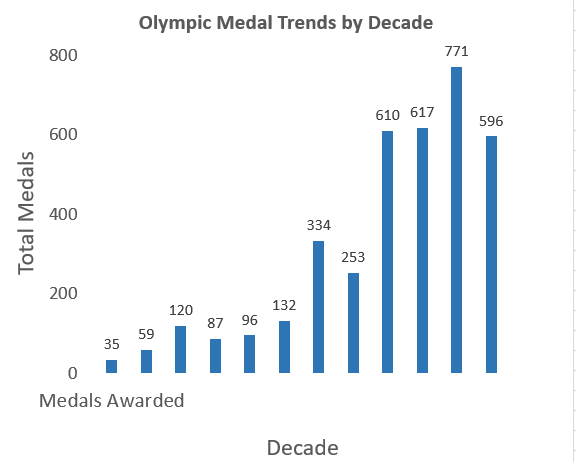

# Olympics-Medals-Analysis

## Overview
This project analyzes Olympic medal data spanning 120 years using SQL and visualization techniques. The dataset, sourced from Kaggle, contains 271,116 rows of athlete and medal information. The goal was to identify trends, top-performing countries, and athlete demographics to enhance data analyst skills for resume-building.

## Dataset
- **Source**: [120 Years of Olympic History: Athletes and Results](https://www.kaggle.com/heesoo37/120-years-of-olympic-history-athletes-and-results)
- **File**: `athlete_events.csv`
- **Columns**: ID, Name, Sex, Age, Height, Weight, Team, NOC, Games, Year, Season, City, Sport, Event, Medal
- **Rows**: 271,116

## Tools Used
- **Database**: MySQL
- **IDE**: MySQL Workbench
- **Visualization**: Microsoft Excel

## Project Steps
1. **Data Import**: Imported `athlete_events.csv` into a MySQL database named `olympics`.
2. **SQL Analysis**: Wrote queries to analyze medal trends, top countries, and athlete statistics.
3. **Visualization**: Exported query results to CSV and created charts in Excel.

## Key Insights
- The USA led with over 1000 gold medals.
- Medal counts peaked in the 2000s with 771 medals.
- Athletics had the most participants (over 10,000).

## Visualizations

*Bar chart showing Olympic medal trends by decade, with a peak of 771 medals in the 2000s.*

## Files
- `README.md`: This file.
- `olympic_queries.sql`: SQL queries used for analysis.
- `medal_trends_chart.png`: Visualization of medal trends.

## How to Run
1. Install MySQL and MySQL Workbench.
2. Create a database: `CREATE DATABASE olympics;`
3. Import `athlete_events.csv` into the `athlete_events` table.
4. Run the SQL queries in `olympic_queries.sql`.

## Future Improvements
- Add more visualizations (e.g., pie chart for medal types).
- Analyze gender distribution of medals.
- Optimize SQL queries for larger datasets.

## Contact
- **Author**: Shubhangi Vishwakarma
- **GitHub**: [ShubhiV13](https://github.com/ShubhiV13)
- **Email**: [vishwakarmashubhangi75@gmail.com]

## License
This project is open-source under the MIT License.
